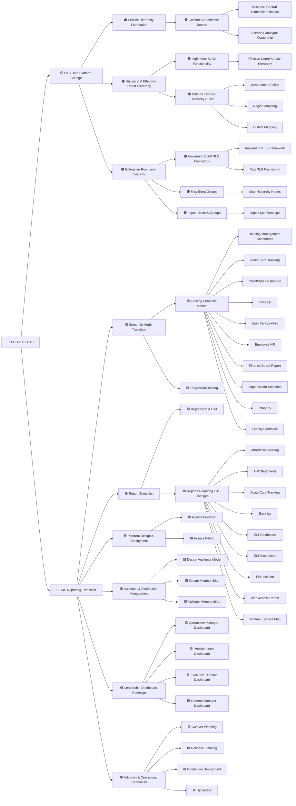

# Project O4S Full Hierarchy  

  

```mermaid  

flowchart LR  

  

O4S["🔴 PROJECT O4S"]  

  

O4S --> EP1["🟡 O4S Data Platform Change"]  

  

 

  

O4S --> EP2["🔵 O4S Reporting Transition"]  

  

%% DATA PLATFORM  

  

EP1 --> F1["🟠 Service Hierarchy Foundation"]  

EP1 --> F2["🟠 Historical & Effective-Dated Hierarchy"]  

EP1 --> F3["🟠 Enterprise Row-Level Security"]  

  

F1 --> US11["🟤 Confirm Authoritative Source"]  

  

US11 --> T111["Business Central Dimensions Impact"]  

US11 --> T112["Service Catalogue Ownership"]  

  

F2 --> US21["🟤 Implement SLD2 Functionality"]  

F2 --> US22["🟤 Define Historical Hierarchy Rules"]  

  

US21 --> T211["Effective-Dated Service Hierarchy"]  

  

US22 --> T221["Restatement Policy"]  

US22 --> T222["Region Mapping"]  

US22 --> T223["District Mapping"]  

  

F3 --> US31["🟤 Implement EDW RLS Framework"]  

F3 --> US32["🟤 Map Entra Groups"]  

F3 --> US33["🟤 Ingest Users & Groups"]  

  

US31 --> T311["Implement RLS Framework"]  

US31 --> T312["Test RLS Framework"]  

  

US32 --> T321["Map Hierarchy Nodes"]  

  

US33 --> T331["Ingest Memberships"]  

  

%% REPORTING TRANSITION  

  

EP2 --> RF1["🟢 Semantic Model Transition"]  

EP2 --> RF2["🟢 Report Transition"]  

EP2 --> RF3["🟢 Platform Design & Deployment"]  

EP2 --> RF4["🟢 Audience & Distribution Management"]  

EP2 --> RF5["🟢 Leadership Dashboard Redesign"]  

EP2 --> RF6["🟢 Adoption & Operational Readiness"]  

  

RF1 --> SM1["🟦 Existing Semantic Models"]  

RF1 --> SM2["🟦 Regression Testing"]  

  

RF2 --> REP1["🟦 Regression & UAT"]  

RF2 --> REP2["🟦 Reports Requiring O4S Changes"]  

  

RF3 --> P1["🟦 Assess Power BI"]  

RF3 --> P2["🟦 Assess Fabric"]  

  

RF4 --> A1["🟦 Design Audience Model"]  

RF4 --> A2["🟦 Create Memberships"]  

RF4 --> A3["🟦 Validate Memberships"]  

  

RF5 --> D1["🟦 Operations Manager Dashboard"]  

RF5 --> D2["🟦 Practice Lead Dashboard"]  

RF5 --> D3["🟦 Executive Director Dashboard"]  

RF5 --> D4["🟦 General Manager Dashboard"]  

  

RF6 --> C1["🟦 Cutover Planning"]  

RF6 --> C2["🟦 Rollback Planning"]  

RF6 --> C3["🟦 Production Deployment"]  

RF6 --> C4["🟦 Hypercare"]  

  

%% MODELS  

  

SM1 --> M1["Housing Management Statements"]  

SM1 --> M2["Acute Care Tracking"]  

SM1 --> M3["ClientStats Dashboard"]  

SM1 --> M4["Easy Up"]  

SM1 --> M5["Easy Up Upskilled"]  

SM1 --> M6["Employee HR"]  

SM1 --> M7["Finance Board Report"]  

SM1 --> M8["Organisation Snapshot"]  

SM1 --> M9["Property"]  

SM1 --> M10["Quality Feedback"]  

  

%% REPORTS  

  

REP2 --> R1["Affordable Housing"]  

REP2 --> R2["AHI Statements"]  

REP2 --> R3["Acute Care Tracking"]  

REP2 --> R4["Easy Up"]  

REP2 --> R5["ELT Dashboard"]  

REP2 --> R6["ELT Exceptions"]  

REP2 --> R7["Fire Incident"]  

REP2 --> R8["Web Access Report"]  

REP2 --> R9["Whānau Service Map"]  

```